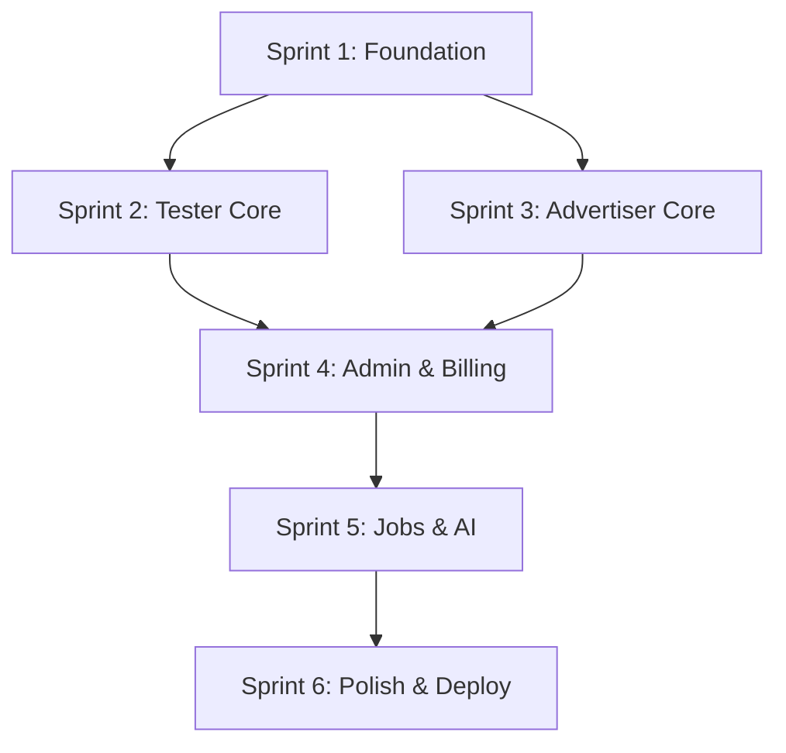

# Sprint Backlog — Reward App Experience/Feedback Platform

> Version: MVP 1.0  
> Date: 2026-01-20  
> Duration: 4 Weeks (6 Sprints × ~3 days each)  
> Team: Assumed 1-2 developers

---

## 1. Sprint Overview

### 1.1 Timeline Summary

| Week | Sprint | Focus | Key Deliverables |
|------|--------|-------|------------------|
| 1 | Sprint 1 | Foundation | Project setup, DB, Auth |
| 1-2 | Sprint 2 | Tester Core | Campaign browse, Submit |
| 2 | Sprint 3 | Advertiser Core | Campaign create, Dashboard |
| 3 | Sprint 4 | Admin & Billing | Review queue, Credits |
| 3-4 | Sprint 5 | Jobs & AI | Fraud, AI Insights |
| 4 | Sprint 6 | Polish & Deploy | Testing, Bug fixes, Launch |

### 1.2 Velocity Assumptions

- Story points: 1 point ≈ 2-4 hours
- Sprint capacity: 20-25 points per sprint
- Total MVP: ~130-150 points

---

## 2. Sprint 1: Foundation (Days 1-4)

**Goal:** Project scaffolding, database, authentication ready

### 2.1 Tasks

| ID | Task | Points | Priority |
|----|------|--------|----------|
| S1-01 | Initialize Next.js project with App Router | 2 | P0 |
| S1-02 | Setup Tailwind CSS + shadcn/ui | 2 | P0 |
| S1-03 | Configure ESLint + Prettier + TypeScript strict | 1 | P0 |
| S1-04 | Setup Prisma + Supabase connection | 3 | P0 |
| S1-05 | Create DB schema (all tables) | 5 | P0 |
| S1-06 | Run initial migration | 1 | P0 |
| S1-07 | Setup NextAuth with Kakao provider | 3 | P0 |
| S1-08 | Setup NextAuth with Naver provider | 2 | P0 |
| S1-09 | Setup NextAuth with Google provider | 2 | P0 |
| S1-10 | Create Tester login page UI | 2 | P0 |
| S1-11 | Create base layouts (Marketing, Tester, Advertiser, Admin) | 3 | P1 |
| S1-12 | Setup shared UI components (Button, Input, Card) | 3 | P1 |
| S1-13 | Create operator seed script | 2 | P1 |
| S1-14 | Setup environment variables structure | 1 | P0 |

**Total Points:** 32

### 2.2 Definition of Done

- [ ] Tester can login via Kakao/Naver/Google
- [ ] User record created in DB after first login
- [ ] JWT token issued and stored
- [ ] All DB tables created
- [ ] Base layouts render correctly

### 2.3 Technical Notes

```bash
# Project init
npx create-next-app@latest reward-platform --typescript --tailwind --app

# Dependencies
npm install @prisma/client next-auth @auth/prisma-adapter
npm install -D prisma

# UI
npx shadcn-ui@latest init
```

---

## 3. Sprint 2: Tester Core (Days 5-8)

**Goal:** Testers can browse campaigns and submit participations

### 3.1 Tasks

| ID | Task | Points | Priority |
|----|------|--------|----------|
| S2-01 | Create Campaign list API (GET /campaigns) | 3 | P0 |
| S2-02 | Create Campaign detail API (GET /campaigns/:id) | 2 | P0 |
| S2-03 | Create Campaign list page UI | 3 | P0 |
| S2-04 | Create Campaign detail page UI | 3 | P0 |
| S2-05 | Setup Supabase Storage for images | 2 | P0 |
| S2-06 | Create presigned URL API for uploads | 2 | P0 |
| S2-07 | Create Submit participation API (POST /participations) | 5 | P0 |
| S2-08 | Create Submit participation page UI (multi-step form) | 5 | P0 |
| S2-09 | Implement image upload component | 3 | P0 |
| S2-10 | Add duplicate participation check | 2 | P1 |
| S2-11 | Add daily limit check (3/day) | 2 | P1 |
| S2-12 | Create My participations list API | 2 | P1 |
| S2-13 | Create My participations list page UI | 3 | P1 |

**Total Points:** 37

### 3.2 Definition of Done

- [ ] Tester can view campaign list with filters
- [ ] Tester can view campaign detail
- [ ] Tester can submit participation (2 images + answers + feedback)
- [ ] Duplicate submission blocked
- [ ] Daily limit enforced
- [ ] Tester can view their submissions

### 3.3 API Contracts

```typescript
// POST /api/v1/participations
// Request: multipart/form-data
{
  campaignId: string;
  answer1: string;
  answer2: string;
  feedback: string;  // min 30 chars
  image1: File;
  image2: File;
}

// Response
{
  success: true;
  data: { id: string; status: 'SUBMITTED'; }
}
```

---

## 4. Sprint 3: Advertiser Core (Days 9-12)

**Goal:** Advertisers can register, create campaigns, view dashboard

### 4.1 Tasks

| ID | Task | Points | Priority |
|----|------|--------|----------|
| S3-01 | Setup NextAuth Credentials for Advertiser | 3 | P0 |
| S3-02 | Create Advertiser register API | 3 | P0 |
| S3-03 | Create Advertiser login API | 2 | P0 |
| S3-04 | Create Advertiser register page UI | 3 | P0 |
| S3-05 | Create Advertiser login page UI | 2 | P0 |
| S3-06 | Create Campaign create API | 4 | P0 |
| S3-07 | Create Campaign create page UI (form) | 5 | P0 |
| S3-08 | Create Advertiser dashboard API | 3 | P0 |
| S3-09 | Create Advertiser dashboard page UI | 4 | P0 |
| S3-10 | Create Advertiser campaign list API | 2 | P1 |
| S3-11 | Create Advertiser campaign list page UI | 3 | P1 |
| S3-12 | Create Campaign publish API (draft → running) | 2 | P1 |
| S3-13 | Create CreditWallet on advertiser registration | 1 | P0 |

**Total Points:** 37

### 4.2 Definition of Done

- [ ] Advertiser can register with email/password
- [ ] Advertiser can login
- [ ] Advertiser can create campaign (draft)
- [ ] Advertiser can publish campaign
- [ ] Advertiser can view dashboard with stats
- [ ] Credit wallet created on registration

### 4.3 Validation Rules

```typescript
// Campaign validation
{
  title: z.string().min(5).max(100),
  description: z.string().min(20).max(2000),
  targetCount: z.number().min(10).max(10000),
  rewardAmount: z.number().min(1000).max(50000),
  creditCostPerValid: z.number().min(rewardAmount),
  endAt: z.date().min(now).max(now + 90days),
  questions: z.array(z.object({
    order: z.enum([1, 2]),
    text: z.string().min(10).max(500)
  })).length(2)
}
```

---

## 5. Sprint 4: Admin & Billing (Days 13-16)

**Goal:** Operators can review, advertisers can top-up credits

### 5.1 Tasks

| ID | Task | Points | Priority |
|----|------|--------|----------|
| S4-01 | Setup Admin auth with TOTP | 4 | P0 |
| S4-02 | Create Admin login page UI (2-step) | 4 | P0 |
| S4-03 | Create Participation review queue API | 3 | P0 |
| S4-04 | Create Participation review queue page UI | 4 | P0 |
| S4-05 | Create Participation detail page UI (admin) | 4 | P0 |
| S4-06 | Create Approve participation API | 3 | P0 |
| S4-07 | Create Reject participation API | 2 | P0 |
| S4-08 | Implement credit deduction on approve | 3 | P0 |
| S4-09 | Create Top-up request API | 3 | P0 |
| S4-10 | Create Top-up request page UI | 3 | P0 |
| S4-11 | Create Top-up confirmation API (admin) | 2 | P0 |
| S4-12 | Create Top-up confirmation page UI (admin) | 3 | P1 |
| S4-13 | Create Admin dashboard page | 4 | P1 |
| S4-14 | Setup Stripe Payment Link integration | 2 | P2 |

**Total Points:** 44

### 5.2 Definition of Done

- [ ] Operator can login with email + password + TOTP
- [ ] Operator can view pending participations
- [ ] Operator can approve/reject participations
- [ ] Credit deducted on approval
- [ ] Advertiser can request bank transfer top-up
- [ ] Operator can confirm top-up
- [ ] Admin dashboard shows pending actions

### 5.3 TOTP Implementation

```typescript
// Using speakeasy for TOTP
import speakeasy from 'speakeasy';

// Generate secret (first login)
const secret = speakeasy.generateSecret({
  name: 'RewardPlatform:admin@example.com'
});

// Verify code
const verified = speakeasy.totp.verify({
  secret: user.totpSecret,
  encoding: 'base32',
  token: userCode,
  window: 1
});
```

---

## 6. Sprint 5: Jobs & AI (Days 17-20)

**Goal:** Background jobs running, fraud detection, AI insights

### 6.1 Tasks

| ID | Task | Points | Priority |
|----|------|--------|----------|
| S5-01 | Create jobs table and queue service | 3 | P0 |
| S5-02 | Setup Supabase Scheduled Function for job runner | 3 | P0 |
| S5-03 | Implement pHash calculation job | 4 | P0 |
| S5-04 | Implement sha256 calculation | 2 | P0 |
| S5-05 | Implement fraud score calculation | 4 | P0 |
| S5-06 | Create fraud signals on submission | 3 | P0 |
| S5-07 | Auto-reject participations with score >= 70 | 2 | P0 |
| S5-08 | Create AI insight generation job | 5 | P0 |
| S5-09 | Create AI insights page UI (advertiser) | 4 | P1 |
| S5-10 | Create insight regeneration API | 2 | P1 |
| S5-11 | Setup Resend for email | 2 | P1 |
| S5-12 | Create email templates (approved/rejected/paid) | 3 | P1 |
| S5-13 | Create email send job | 2 | P1 |
| S5-14 | Create reward record on approval | 2 | P0 |
| S5-15 | Create reward queue page UI (admin) | 3 | P1 |

**Total Points:** 44

### 6.2 Definition of Done

- [ ] Jobs enqueued on participation submit
- [ ] pHash calculated for images
- [ ] Fraud score calculated
- [ ] Auto-rejection working
- [ ] AI insights generated (10+ approved)
- [ ] Emails sent on status change
- [ ] Reward queue visible to admin

### 6.3 Job Runner Logic

```typescript
// Supabase Scheduled Function
export async function runJobs() {
  const jobs = await prisma.job.findMany({
    where: {
      status: 'PENDING',
      scheduledAt: { lte: new Date() }
    },
    orderBy: [
      { priority: 'desc' },
      { scheduledAt: 'asc' }
    ],
    take: 50
  });

  for (const job of jobs) {
    try {
      await processJob(job);
    } catch (error) {
      await handleJobError(job, error);
    }
  }
}
```

---

## 7. Sprint 6: Polish & Deploy (Days 21-24)

**Goal:** Bug fixes, testing, deployment, launch ready

### 7.1 Tasks

| ID | Task | Points | Priority |
|----|------|--------|----------|
| S6-01 | End-to-end testing: Tester flow | 3 | P0 |
| S6-02 | End-to-end testing: Advertiser flow | 3 | P0 |
| S6-03 | End-to-end testing: Admin flow | 3 | P0 |
| S6-04 | Bug fixes from testing | 5 | P0 |
| S6-05 | Create audit log entries for key actions | 3 | P1 |
| S6-06 | Create audit logs page UI (admin) | 3 | P1 |
| S6-07 | Setup Vercel deployment | 2 | P0 |
| S6-08 | Configure production environment | 2 | P0 |
| S6-09 | Setup domain and SSL | 1 | P0 |
| S6-10 | Create landing page (basic) | 3 | P1 |
| S6-11 | Setup error tracking (Sentry) | 2 | P1 |
| S6-12 | Performance optimization | 2 | P2 |
| S6-13 | Security review checklist | 2 | P0 |
| S6-14 | Documentation: README, deployment guide | 2 | P1 |

**Total Points:** 36

### 7.2 Definition of Done

- [ ] All core flows tested and working
- [ ] Critical bugs fixed
- [ ] Production deployed to Vercel
- [ ] Domain configured
- [ ] Error tracking active
- [ ] Launch checklist completed

### 7.3 Launch Checklist

```markdown
## Pre-Launch Checklist

### Security
- [ ] Environment variables secured
- [ ] Admin whitelist configured
- [ ] TOTP enforced for operators
- [ ] Rate limiting configured
- [ ] CORS configured

### Data
- [ ] Database backups enabled
- [ ] Seed operator created
- [ ] Test data cleaned

### Monitoring
- [ ] Sentry configured
- [ ] Supabase alerts enabled
- [ ] Job queue monitoring

### Business
- [ ] Bank account ready for deposits
- [ ] Stripe Payment Links created
- [ ] Email templates tested
- [ ] Support email configured
```

---

## 8. Backlog (Post-MVP)

### 8.1 v1.1 Features

| ID | Feature | Estimate |
|----|---------|----------|
| V11-01 | Push notifications | 5 |
| V11-02 | Operator invite system | 3 |
| V11-03 | Advertiser social login | 2 |
| V11-04 | Campaign pause/resume from low credit | 2 |
| V11-05 | Bulk approve/reject | 3 |
| V11-06 | Export participations to CSV | 2 |
| V11-07 | Advanced fraud detection (IP, velocity) | 5 |
| V11-08 | Gifticon API integration | 8 |

### 8.2 v1.2 Features

| ID | Feature | Estimate |
|----|---------|----------|
| V12-01 | Video submission support | 8 |
| V12-02 | Multi-language (EN) | 5 |
| V12-03 | Advanced analytics dashboard | 8 |
| V12-04 | API for external integrations | 5 |

---

## 9. Risk Register

| Risk | Impact | Mitigation |
|------|--------|------------|
| Social OAuth issues | High | Test all providers early |
| Supabase limits | Medium | Monitor usage, plan upgrade |
| AI API costs | Medium | Use gpt-4o-mini, batch processing |
| Fraud bypass | High | Manual review buffer |
| Scope creep | High | Strict MVP boundaries |

---

## 10. Daily Standup Template

```markdown
## Standup - [Date]

### Yesterday
- [ ] Completed task X
- [ ] Reviewed PR Y

### Today
- [ ] Working on task Z
- [ ] Code review for W

### Blockers
- None / Describe blocker
```

---

## 11. Sprint Ceremonies

| Ceremony | When | Duration |
|----------|------|----------|
| Sprint Planning | Day 1 of sprint | 1 hour |
| Daily Standup | Every day | 15 min |
| Sprint Review | Last day of sprint | 30 min |
| Retrospective | Last day of sprint | 30 min |

---

## Appendix: Task Dependencies



---

*End of Sprint Backlog Document*
